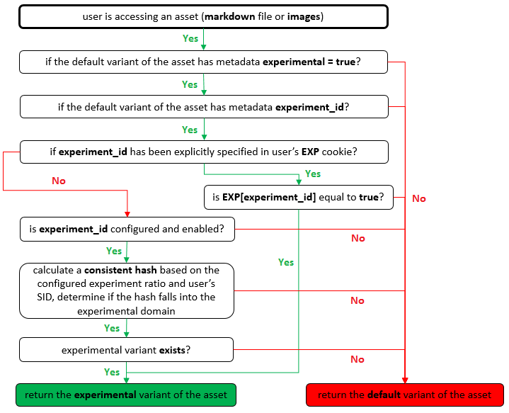
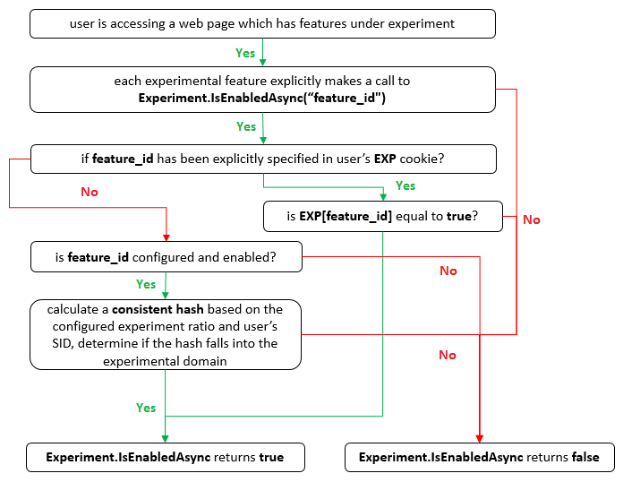

# A / B 测试

**内容级别 A / B 测试 ︰** A / B 测试特定文档或资源。

**全局 A / B 测试 ︰** A / B 测试对某个宽的范围，它适用于给定的站点 （或特定区域设置） 中的所有项目的示例主题和页面布局。

   

## 内容级别 A / B 测试
*内容级别 A / B 测试* 允许 **内容所有者** 向自助服务遇到传递的同一个 url，指定的拆分比率，并且获得 BI 的统计信息的内容的变体。

例如，可以编写器 **hello.md** 和 **hello.experimental.md**, ，并指定只有 10%的最终用户将看到该文档的实验版本。

### 设计原则 ︰

1. 请注意事项 **更简单** 如果可能，避免通过设计-尤其累积时实际上并没有使用的功能。
2. 所有 **类型的内容** 应该能够运行 A / B 测试，包括 markdown 文件、 纯 HTML 文件、 图像和音频/视频文件。
3. A / B 测试 **粒度** 应非常灵活，可以覆盖单个文档或一支庞大的资产 （例如图像）。
4. 用户应该 **关联**, ，这一次意味着用户已路由到一个版本，他/她应始终会看到一个版本文档，除非浏览器会话信息是否已显式擦除出 （例如 Ctrl + Shift + Delete 或 InPrivate 会话）。
5. 应为 **快速**, 、 创建新的测试、 打开/关闭 A / B 测试，或更新拆分比例应中生效 **小于 30 秒**。
6. **极端情况下应已正确涵盖**, 、 / B 测试应该顺利地在工时 **CDN 环境**。 此外，特殊逻辑应准备就绪，可确保只有默认变体 *"A 版本"* 通过 **搜索爬网程序** ，如 Google 和 Bing。
7. 自然 **集成** 到 BI 和见解。

### 内部流关系图 ︰

   

## 全局级别 A / B 测试

*全局级别 A / B 测试* 启用两个主要方案 ︰

- 它允许以几乎无法进行验证或证明，通常通过协作的某些功能假设 **功能利益干系人、 功能 PM 和开发人员**。
- 它允许 **工程团队** 顺利地推出一项功能。

### 设计原则 ︰

1. 起见 **更简单** 如果可能，单个 API `Experiment.IsEnabledAsync` 可用于执行 (JavaScript) 客户端和服务器 (C#) 端。
2. 简化开发人员能够测试并查看开/关-并行的功能。
3. 用户应该 **关联**, ，这一次意味着用户看到的一项功能打开的 X，他/她始终应看到 X，除非浏览器会话信息是否已显式擦除出 （例如 Ctrl + Shift + Delete 或 InPrivate 会话）。
4. 应为 **快速**, 、 实施新的测试、 打开/关闭 A / B 测试，或更新拆分比例应中生效 **小于 30 秒**。
5. 自然 **集成** 到 BI 和见解。

### 内部流关系图 ︰

   

### 示例代码 (ECMAScript)

```javascript
Experiment.IsEnabledAsync('your_cool_feature_name_or_id').done(function(fEnabled){
    if (fEnabled) {
        // do something, in case the experiment is ON for this specific session
    } else {
        // do something else, in case the experiment is OFF for this specific session
    }
});
```

#### 真实的示例

请立即试用这 ！ 打开 F12 控制台并运行下面的代码 ︰

```javascript
Experiment.IsEnabledAsync('use_super_large_font').done(function(fEnabled){
    document.body.style['font-size'] = fEnabled ? '300%' : '150%';
});
```


<!--HONumber=May16_HO4-->


