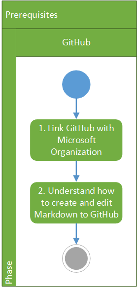
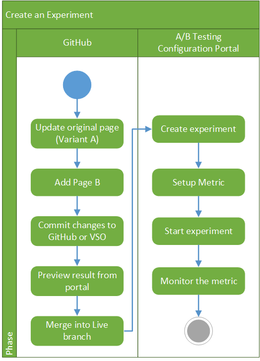
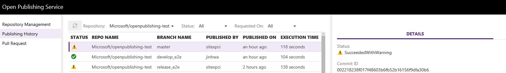
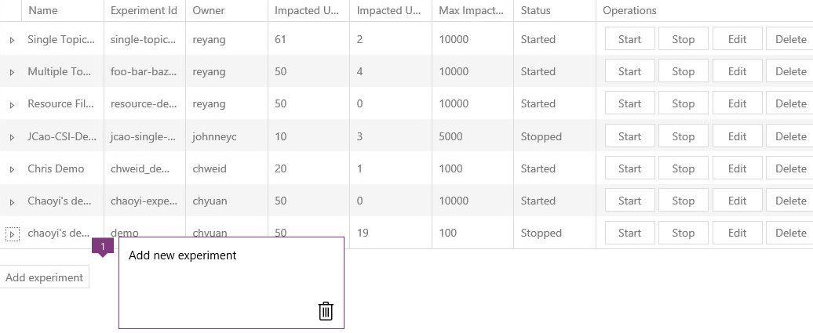
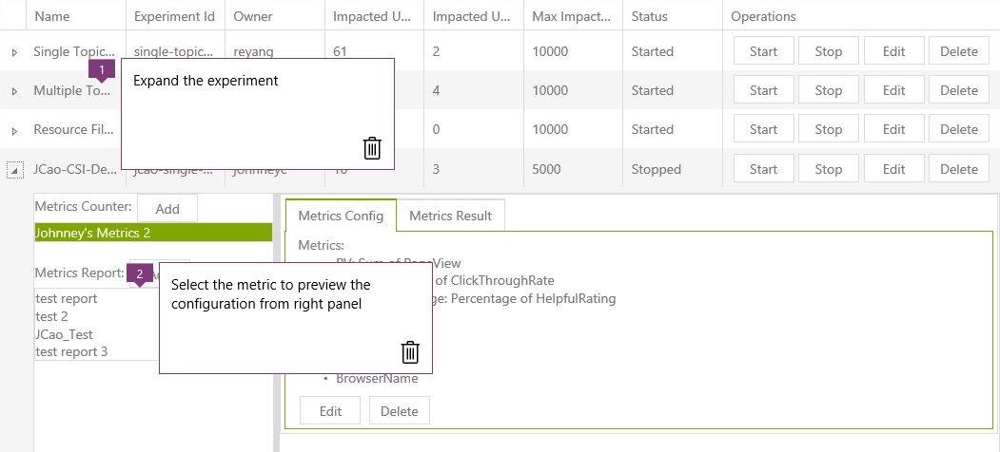
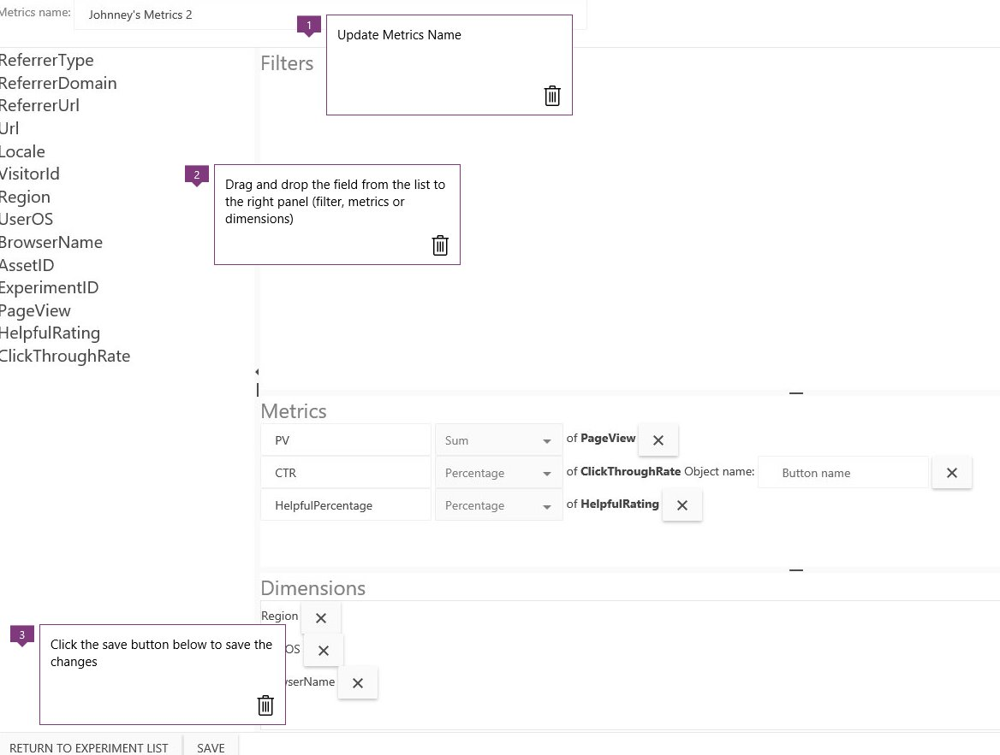
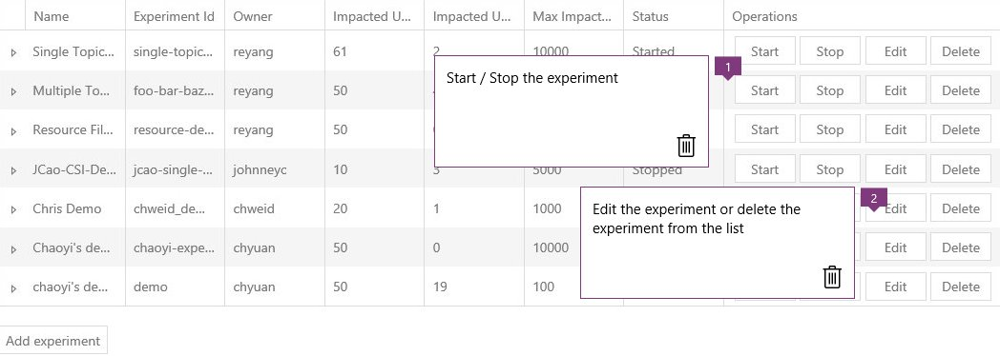
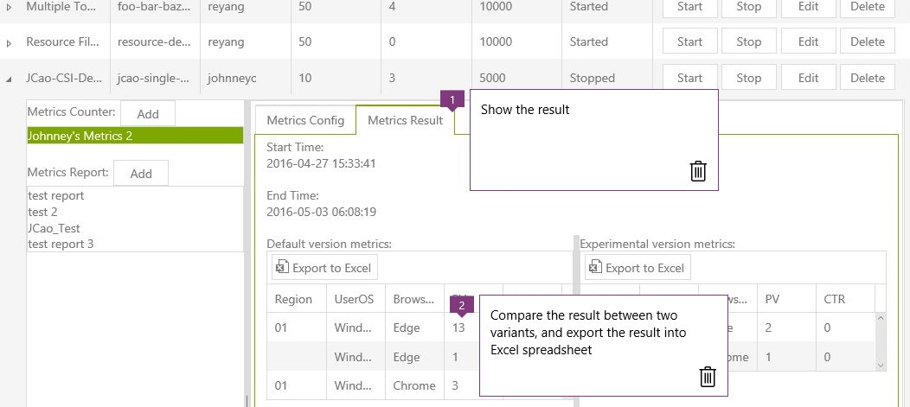
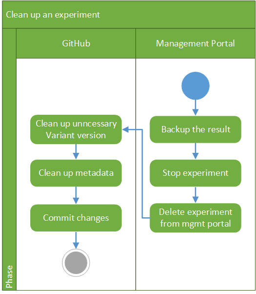

#用户手册的内容级别 A / B 测试

##先决条件

- 请按照步骤 [如何加入 Microsoft GitHub 组织](http://https://opensourcehub.microsoft.com/articles/how-to-join-microsoft-github-org-self-service) 以链接 Microsoft 组织您的 GitHub 帐户。
- 读取 CSI 指令如何了解过程到 **创建** / **编辑** /**提交** Markdown 文件到 GitHub。 此手册真的不考虑内容的创建/修订版本。
- 使用 **工作** 分支合并到实时环境，这始终是前的 **最佳做法**。

##分步

###创建新试验

####第一部分 ︰ 工作分支中的实验性文件设置。

- A / B 测试需要两个单独 markdown 文件、 A 变体和 B 变体。 为现有的已发布页，可能已有一个变体。

1. 切换到您 **工作** 分支 ︰
    - 如果在本地使用，切换到您本地临时分支。 临时分支都是用于提交的更改将被发布到任何一个分支 [阶段终结点](https://stage.docs.microsoft.com)。

2. 编辑变体页 ︰
    - 通过添加以下元数据中编辑您的源文件 (页 A)::
        > `experiment:true`
        >`experiment_id:`,

        `experiment_id` 是试验的唯一 id。 我们建议您试验的 id 应该窗体的 &lt;youralias&gt;-&lt;experimentname&gt;-&lt;日期&gt;

3. 创建变体 B 页 ︰
    - 使用所有页 A 的原始元数据的同一文件夹中创建变体 B 页主题。 添加 `experiment_id` 字段并使用您创建相同的试验 ID 为 A 变体。
    - 保存 Variant B 页时使用以下文件名称结构 ︰ &lt;sourcefilename&gt;`.experimental.md`。 例如：
        - 如果变体为 CSI demo.md，然后 B variant 类型的值应为 CSI demo.experimental.md

4. 添加并提交所做的更改 ︰
    - 如果在本地使用，必须将这些本地更改拉取请求与在 GitHub 上的临时分支与合并。 如果您正在 GitHub 上，只需提交所做的更改。 文件提交到 GitHub 上的临时分支之后，它将自动触发过渡分支的操作生成。

5. 预览门户的结果 ︰
    - 打开操作门户网站，请等待，直到完成生成时没有错误消息。

    

    - 打开阶段站点并预览结果。

6. 合并到活动分支的变体 A 和变体 B
    - 一旦您已确认 A 和 B 的变体是在暂存服务器上可用，合并您的变体 A 和 B variant 类型的值发送到 **Live** 分支发布到生产站点。

####第二部分 ︰ 创建试验在 A / B 测试配置门户。

1. 创建试验 ︰

    - 打开 [A / B 配置门户](https://abtestingportal.azurewebsites.net/#/experiments), ，然后单击 **添加试验** 若要创建新试验。

    

        - Experiment id fields can be either `document_id` or `experiment_id` in the Variant A page. For now, please enter the `experiment_id` you created for your experiment.

    

        - Select the percentage of users who will see Variant B. The percentage can be from 0% to 100%, we recommend 50% as a starting point. Enter the percentage *without* a percent sign.
        - Select the maximum number of users who will see the B variant. Note that at the moment this is not enforced (the experimentation framework *will* keep track of how many users see the B variant, but it will *NOT* yet automatically shut off the experiment when that number is reached). A good number to start with is in the range of 500 – 1000.
    - 保存此试验。 您将返回到试验前在门户页。
    - 通过添加前缀来预览结果 `https://stage.docs.microsoft.com/_chrome/experiment.htm#` 页 A 和 B 之间进行切换

2. 安装程序度量值 ︰
    - 展开从试验 [A / B 配置门户](https://abtestingportal.azurewebsites.net/#/experiments)。

    

    - 单击 **编辑** 从 **指标配置** 选项卡。

    

3. 开始此试验 ︰
    - 单击 **启动** 按钮以便开始此试验。

    

4. 监视度量值的结果 ︰
    - 单击 **指标结果** 以显示结果。 (请注意，它将采用有关 4-6 个小时从 WEDCS 由于延迟时间显示结果)

    

###清理 A/B 测试一次完成。

1. 备份结果导出到 Excel 指标结果的结果 ︰
    - 打开 A / B 配置门户中，然后选择此试验。
    - 选择度量值，单击 **指标结果** 选项卡上，然后单击 **导出 EXCEL** 导出结果。
    - 重复 **导出 EXCEL** 的相关度量值。

    

2. 停止此试验 ︰
    - 单击 **停止** 按钮以停止此试验。

    

3. 删除从试验 [A / B 配置门户](https://abtestingportal.azurewebsites.net/#/experiments):
    - 单击 **删除** 按钮以从列表中删除此试验。

4. 清除不必要的变体版本。
    - 完成此实验后，应保留的最终版本，并从文档存储库中删除不必要的版本。
        - 如果选择一个变体，请删除 Variant b。
        - 如果选择 Variant B、 从 Variant B 将内容复制到 variant 类型的值的和删除变量 b。

5. 清除 Markdown 文件中的元数据
    - 删除 `experiment:true` 和 `experiment_id` 从最终 Markdown 文件

6. 提交更改。

## 其他资源
- 环境 ︰ [环境的内容级别](http://onenote:#Environments%20-%20Content%20Level&section-id={7011B86A-3C76-4C37-8F41-C26A380ADAEC}&page-id={B1125C68-7C08-49DA-A45C-8ADE3A315520}&end&base-path=https://microsoft.sharepoint.com/teams/Visual_Studio_China/Shared%20Documents/Open%20Publishing/AB%20Testing.)

<!--HONumber=May16_HO4-->

